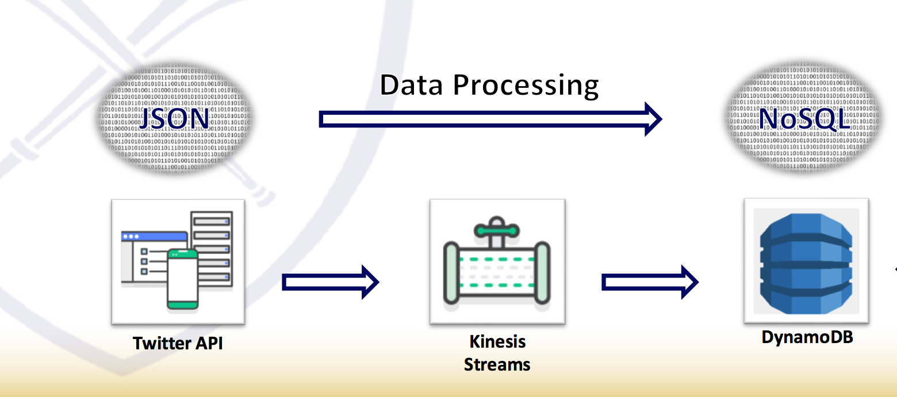
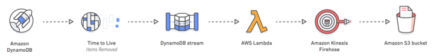

# Objective
Using a DynamoDB table to capture specific tweet IDs aspects from Kinesis.Another streaming with the Deletion of tweets to be automatically archived to storage medium(S3) Using AWS Lambda and Amazon Kinesis Firehose.The AWS Tools used are Kinesis Streams, DynamoDB, Kinesis-Firehose,Lambda,Sagemaker and S3 services.

At a high level, this project takes you through the following steps:

Creating the DynamoDB table, with the tweet ID as the primary key.

Loading Realtime ingestion data into dynamodb using Twitter API and by linking the Kinesis stream to DynamoDB, parsing and storing tweets.

Create DynamoDB Streams on your DynamoDB table to capture deleted twitter items.

Create a Lambda function to poll the DynamoDB stream and deliver batch records from streams to Firehose.

Create a Firehose delivery stream to load the data into S3.

Validate that the application works.

#### Architecture of workflow1 in AWS(Streaming Tweets to DDB)

#### Architecture of workflow2 in AWS(Deleting Tweets and storing in S3)

#### What is AWS Dynamodb?
AWS DynamoDB is a is a key-value and document database that delivers single-digit millisecond performance at any scale.

AWS DynamoDB is designed DynamoDB is serverless with no servers to provision, patch, or manage and no software to install, maintain, or operate. DynamoDB automatically scales tables up and down to adjust for capacity and maintain performance. Availability and fault tolerance are built in, eliminating the need to architect your applications for these capabilities.

#### What is S3?
Amazon Simple Storage Service is storage for the Internet. It is designed to make web-scale computing easier for developers.

Amazon S3 has a simple web services interface that you can use to store and retrieve any amount of data, at any time, from anywhere on the web. It gives any developer access to the same highly scalable, reliable, fast, inexpensive data storage infrastructure that Amazon uses to run its own global network of web sites. The service aims to maximize benefits of scale and to pass those benefits on to developers.

This guide explains the core concepts of Amazon S3, such as buckets, access points, and objects, and how to work with these resources using the Amazon S3 application programming interface (API). 

#### What is DYNAMODB STREAMS?
DynamoDB Streams captures a time-ordered sequence of item-level modifications in any DynamoDB table and stores this information in a log for up to 24 hours. Applications can access this log and view the data items as they appeared before and after they were modified, in near-real time

#### What is LAMBDA?

AWS Lambda lets you run code without provisioning or managing servers. You pay only for the compute time you consume.With Lambda, you can run code for virtually any type of application or backend service - all with zero administration. Just upload your code and Lambda takes care of everything required to run and scale your code with high availability. You can set up your code to automatically trigger from other AWS services or call it directly from any web or mobile app.

#### What is KINESIS FIREHOSE?
Amazon Kinesis Data Firehose is a fully managed service for delivering real-time streaming data to destinations such as Amazon Simple Storage Service (Amazon S3), Amazon Redshift, Amazon Elasticsearch Service (Amazon ES), and Splunk. Kinesis Data Firehose is part of the Kinesis streaming data platform, along with Kinesis Data Streams, Kinesis Video Streams, and Amazon Kinesis Data Analytics. With Kinesis Data Firehose, you don't need to write applications or manage resources. You configure your data producers to send data to Kinesis Data Firehose, and it automatically delivers the data to the destination that you specified

#### What is KINESIS?
Amazon Kinesis makes it easy to collect, process, and analyze real-time, streaming data so you can get timely insights and react quickly to new information. Amazon Kinesis offers key capabilities to cost-effectively process streaming data at any scale, along with the flexibility to choose the tools that best suit the requirements of your application. With Amazon Kinesis, you can ingest real-time data such as video, audio, application logs, website clickstreams, and IoT telemetry data for machine learning, analytics, and other applications. Amazon Kinesis enables you to process and analyze data as it arrives and respond instantly instead of having to wait until all your data is collected before the processing can begin

